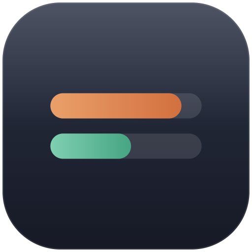
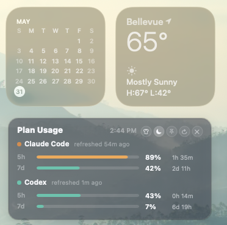
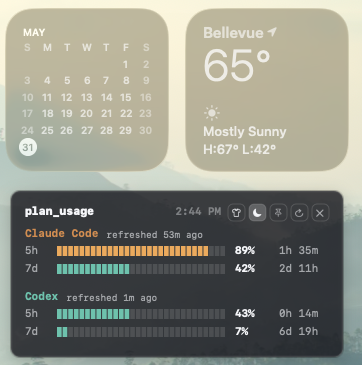

# VibeGauge - Claude Code and Codex Usage Tracker for macOS

<p>
  
</p>

VibeGauge is a compact native macOS desktop widget for tracking Claude Code usage limits and OpenAI Codex rate limits in one place. It shows your 5-hour and 7-day quota windows, used percentage, and reset countdown so you can keep coding without guessing when Claude Code or Codex will run out.

Use VibeGauge as a lightweight Claude Code quota tracker, Codex usage monitor, and AI coding rate-limit widget for vibe coding workflows on macOS.

## Quick Start

Download the latest `VibeGauge.zip` from GitHub Releases, unzip it, then double-click:

```text
VibeGauge.app
```

You can also launch it from Terminal:

```sh
open "VibeGauge.app"
```

End users do not need to build the app from source.

By default, VibeGauge uses the **Direct API** Claude Code data source because it refreshes independently of open Claude Code sessions. If you prefer not to grant Keychain access, right-click the widget and choose:

```text
Claude Source -> Local Capture
```

If Direct API is rate-limited or Claude Code's token is stale, you can opt in to Claude Desktop's browser session:

```text
Claude Source -> Claude Desktop Session
```

## What It Does

VibeGauge shows your current Claude Code and OpenAI Codex quota windows in a small floating desktop widget:

- 5-hour and 7-day quota usage for Claude Code.
- 5-hour and 7-day rate-limit usage for Codex.
- Time remaining until each quota window refreshes.
- Relative data refresh age next to each service name.
- Automatic background refresh without blocking the widget UI.
- Native, Mono, and Terminal skins with light/dark appearance.
- Optional always-on-top behavior.

Usage bars are color-coded by quota usage:

- Green: 50% or below.
- Orange: above 50%.
- Red: 90% or above.

## Who It Is For

VibeGauge is useful if you:

- Use Claude Code and Codex together for AI-assisted coding.
- Want a Claude Code usage limit widget instead of opening settings repeatedly.
- Need a Codex rate limit tracker that reads local Codex session data.
- Care about 5-hour and weekly AI coding quota windows.
- Want a small always-on-top macOS widget for monitoring AI coding credits while working.

## Screenshots





## Claude Code Setup

VibeGauge supports three Claude Code data sources. You can switch between them from the widget context menu:

```text
Right-click widget -> Claude Source
```

### Option 1: Claude Desktop Session

This opt-in source reads Claude Desktop's local encrypted cookie database, decrypts Claude cookies through the macOS Keychain item used by Claude Desktop, and requests the same Claude web usage endpoint used by the Settings page:

```text
https://claude.ai/api/organizations/<your-org-id>/usage
```

VibeGauge does not save, print, upload, or log the cookie values. Cookies are used only in memory to make the usage request.

Pros:

- Refreshes independently of Claude Code terminal sessions.
- Works when Claude Code's OAuth access token is expired.
- Usually matches the Claude Desktop Settings usage page directly.
- Avoids waiting for Claude Desktop's HTTP cache to update.

Cons:

- Requires access to Claude Desktop's encrypted cookie store and its macOS Keychain safe-storage key.
- Uses your Claude Desktop login session to make a usage request.
- May trigger a Keychain permission prompt.
- More sensitive than Direct API or Local Capture, so it is opt-in and not the default.
- If Claude Desktop changes its cookie encryption or usage endpoint, this source may need an update.

### Option 2: Direct API

This is the default. VibeGauge reads the existing Claude Code OAuth token from the precise macOS Keychain item used by Claude Code:

```text
Service: Claude Code-credentials
Account: your macOS username
```

It then requests Claude's usage endpoint:

```text
https://api.anthropic.com/api/oauth/usage
```

Pros:

- Most accurate and responsive source.
- Does not depend on an open Claude Code terminal session.
- Avoids stale `statusLine` snapshots.
- Matches the Claude Code Settings usage page more closely.

Cons:

- Requires macOS Keychain access to Claude Code's OAuth token.
- May trigger a Keychain permission prompt the first time the app runs.
- Sends a usage request to Anthropic from VibeGauge.
- If Claude Code changes its Keychain storage format, this source may need an update.

### Option 3: Local Capture

Local Capture avoids reading OAuth tokens. It relies on Claude Code's `statusLine` payload and local cache files. Install the capture wrapper once:

```sh
./install-claude-statusline-capture.sh
```

The wrapper preserves your existing status line command and writes the latest status payload to:

```sh
~/.claude/vibegauge-status.json
```

Restart Claude Code or open a new Claude Code session after installing this wrapper. Already-running sessions may keep the old status line command and will not update the capture file.

Pros:

- Does not read OAuth tokens or cookies.
- Works entirely from local files after Claude Code writes status data.
- More conservative privacy posture.

Cons:

- Less reliable: Claude Code must actively refresh its status line.
- Existing Claude Code sessions may keep old settings until restarted.
- Data can become stale if Claude Code is closed, idle, suspended, or not emitting `statusLine` payloads.
- May require `zstd` to read Claude desktop HTTP cache fallback data. Homebrew commonly installs it at:

```sh
/opt/homebrew/bin/zstd
```

If Claude Desktop Session or Direct API fails, VibeGauge automatically falls back to the local sources for that refresh.

## Build From Source

If you want to build VibeGauge locally instead of downloading a release:

```sh
./build-widget.sh
```

The script creates `VibeGauge.app` in the project folder.

## Controls

- Click `x` on the widget to quit.
- Click the shirt button to cycle Native, Mono, and Terminal skins.
- Click the sun/moon button to toggle light/dark mode.
- Click the pin button to toggle always-on-top mode.
- Click the refresh button to refresh live quota data.
- Drag the dotted handle at the top center to move the widget.
- Hold `Command` or `Option` and drag anywhere on the widget to move it.
- Right-click the widget to choose an exact style, switch light/dark appearance, choose Claude Code data source, refresh, or quit.
- Hover any top button to see what it does.
- Press `Esc` while the widget is focused to quit.
- The widget redraws countdowns every 30 seconds and checks source-file changes every two minutes.

## Styles

- `Native`: macOS glass-style panel.
- `Mono`: dense terminal-style text panel.
- `Terminal`: retro sage/phosphor layout.

## Data Sources

- Codex reads the latest `rate_limits` event from `~/.codex/sessions` and `~/.codex/archived_sessions`.
- Claude Code uses Direct API by default, with user-selectable Claude Desktop Session and Local Capture modes.
- Context-window usage is intentionally not used because it is not subscription quota.
